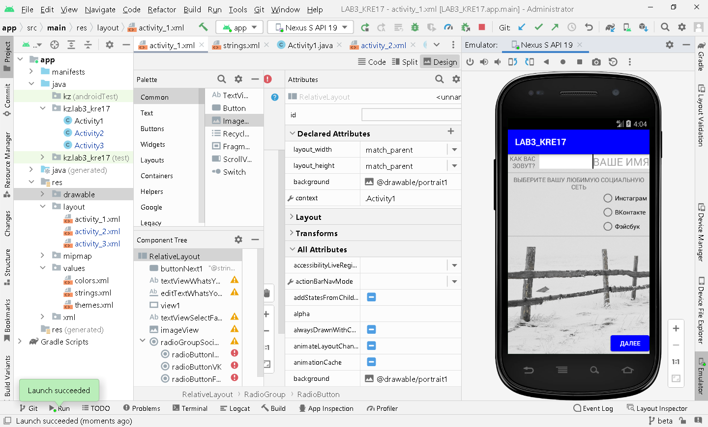
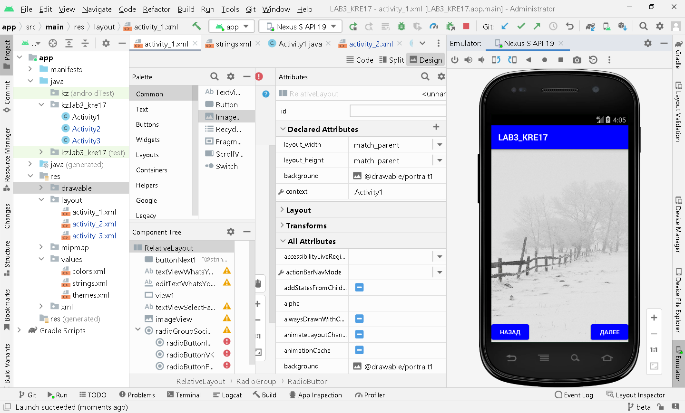
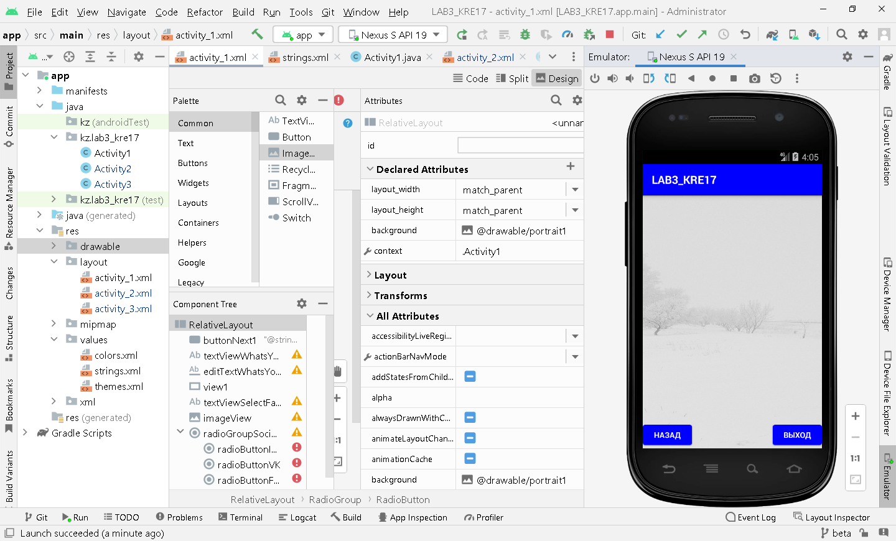

```
Сделать многооконную программу из 3-х окон с:
1) элементами выбора
2) полями ввода
3) картинками
4) различным фоном
5) кнопками "вперед", "назад", "выход"
На 3-м окне вывести данные, указанные в предыдущих окнах.
```

